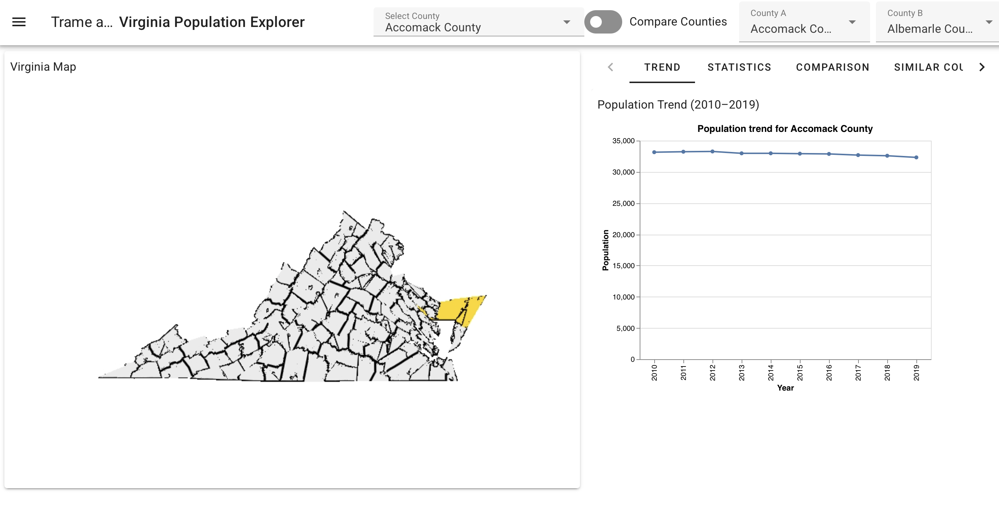
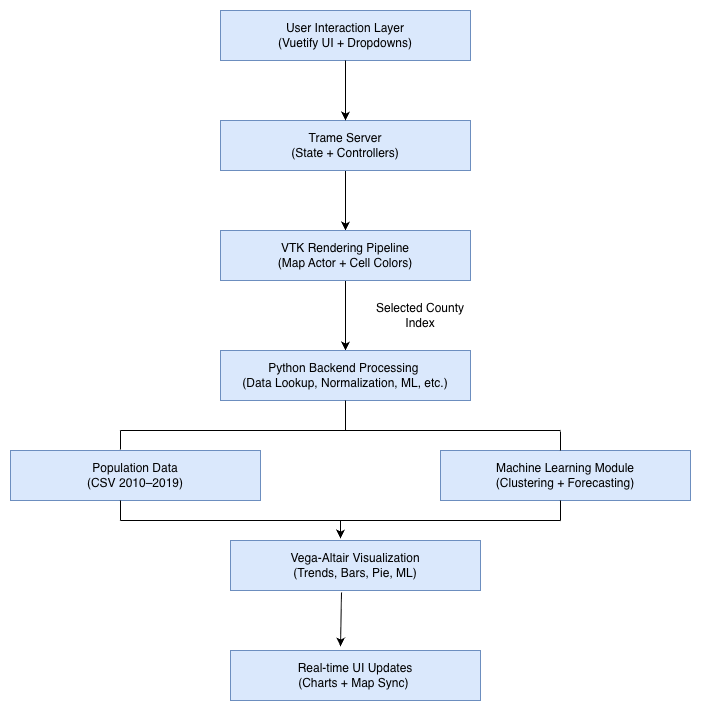
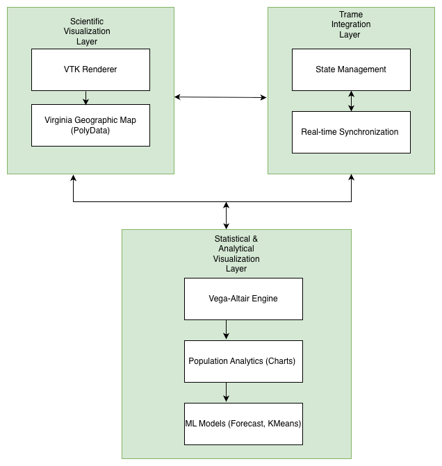
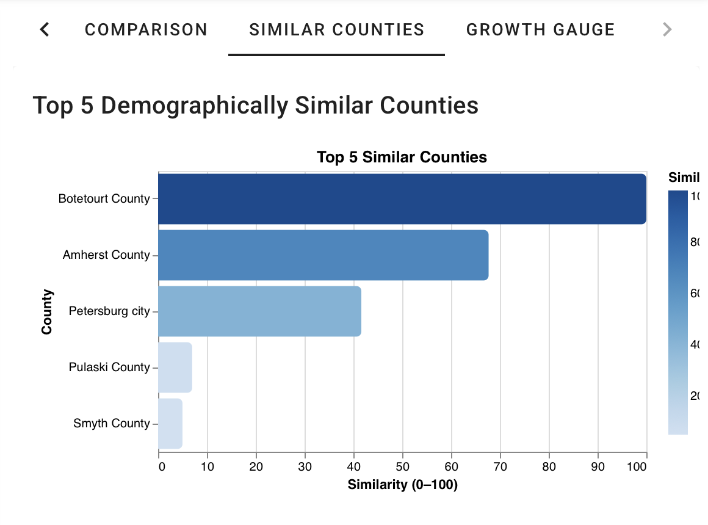
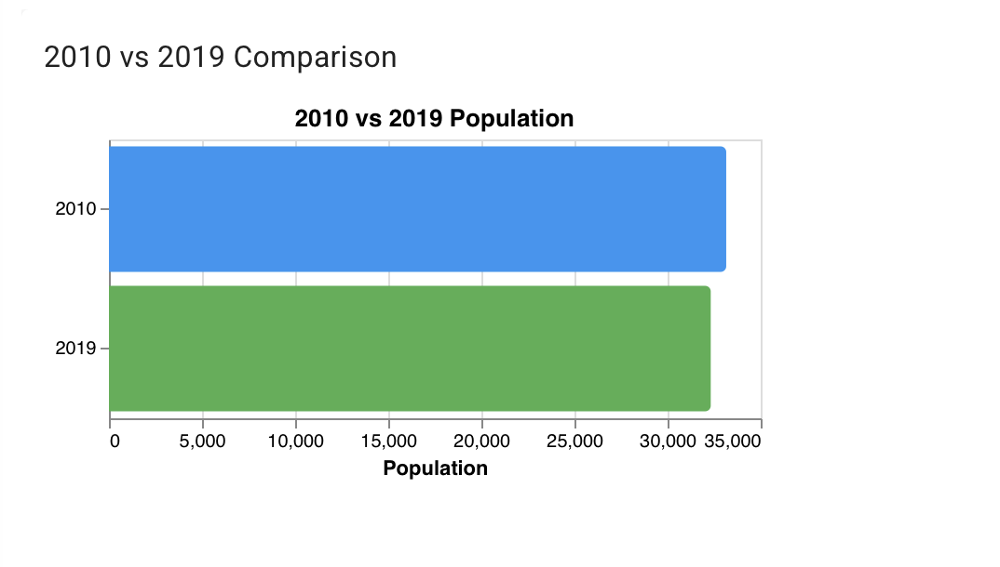
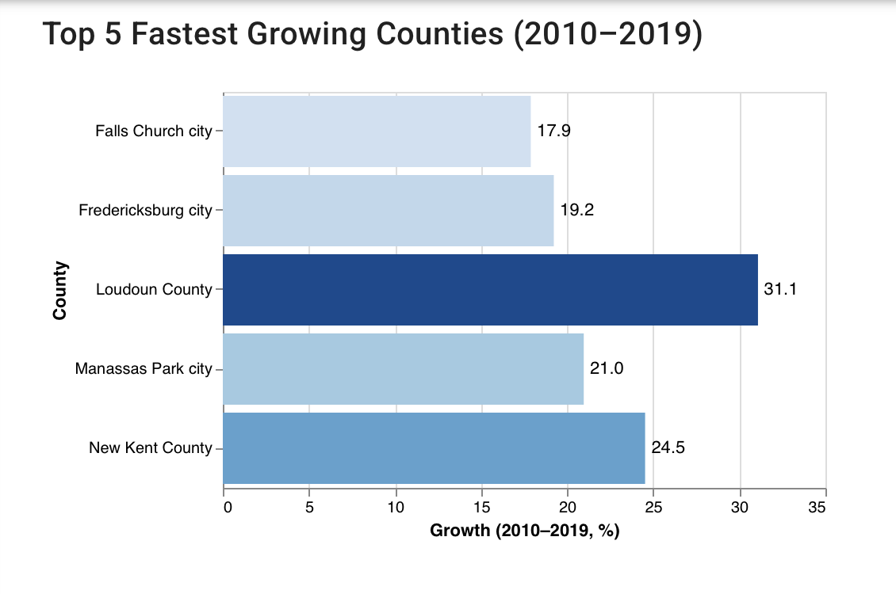
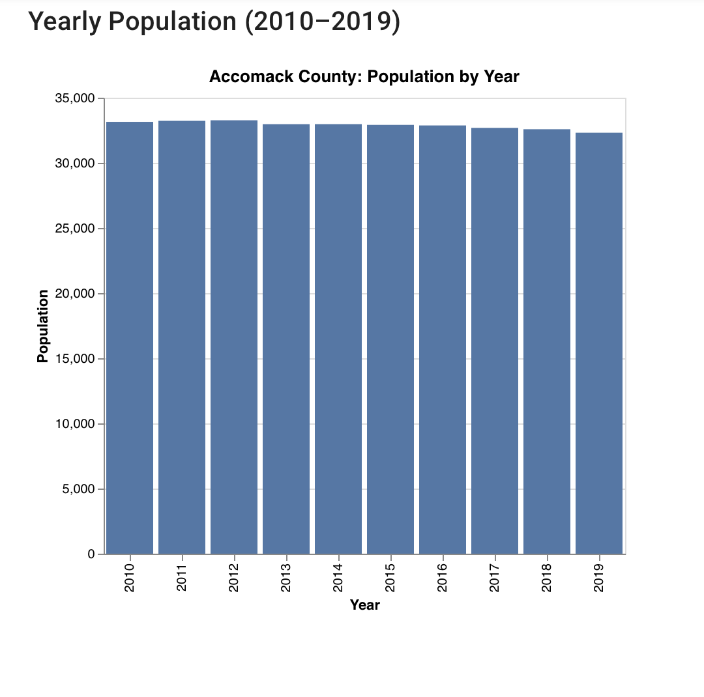
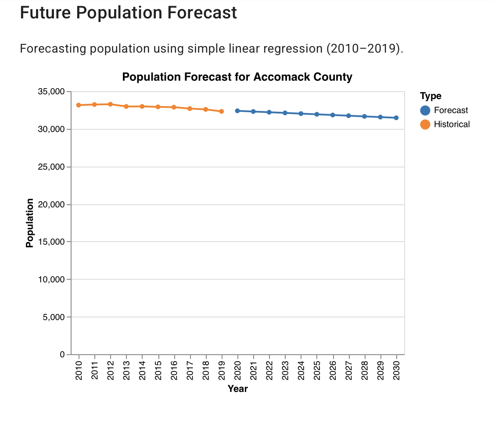
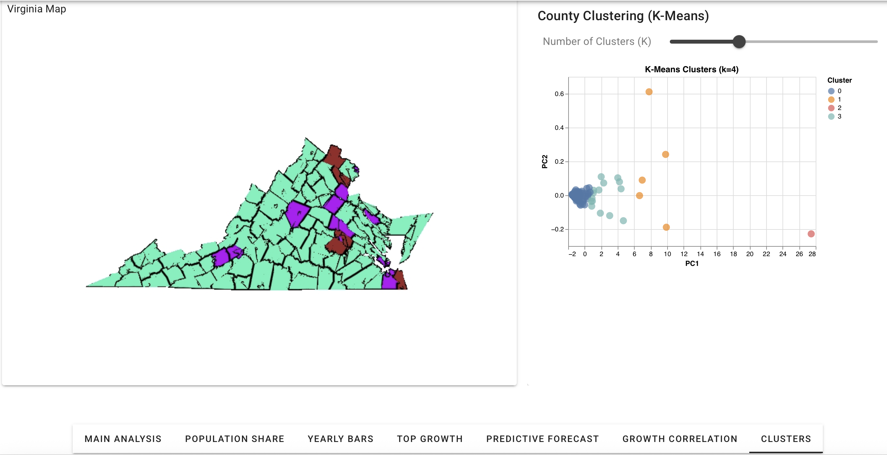

# Interactive Population Visualization of Virginia

### Built with VTK, Trame, and Vega-Altair

An interactive, browser-based system for exploring county-level population trends across Virginia from 2010–2019. The app combines high-performance geographic rendering with declarative statistical charting and lightweight machine learning to let users explore spatial and temporal population patterns side by side.

Built as part of COSC 6344 (Visualization), Fall 2025, University of Houston.

**Authors:** Jayachandra Sarika, Anjani Kumar Avadhanam, Minh Nguyen

---

## Overview

Traditional charts and static maps struggle to show spatial and temporal population data together. This project links a VTK-rendered county map with Vega-Altair analytical charts through the Trame framework, so that selecting a county on the map instantly updates every chart, and vice versa.

### Features

- Interactive VTK map of all 133 Virginia counties/independent cities
- Population trend lines, yearly bar charts, and 2010 vs. 2019 comparisons
- Demographic similarity ranking between counties
- Two-county comparison mode
- K-Means clustering (with PCA projection) to group counties by population trend shape
- Linear regression forecasting of population through 2030
- Growth correlation heatmap across yearly intervals

---

## Screenshots

**System overview**


**System architecture**


**Synchronized map + trend view**


**Demographically similar counties**


**Two-county comparison**


**Top 5 fastest-growing counties**


**Yearly population distribution**


**Population forecast (2020–2030)**


**K-Means clustering with PCA**


---

## Tech Stack

- **VTK** — geographic map rendering
- **Trame** — server-client state management and UI
- **Vega-Altair** — statistical/analytical charts
- **scikit-learn** — K-Means clustering, StandardScaler
- **NumPy / Pandas** — data processing, linear regression forecasting

---

## Getting Started

### 1. Clone the repository

```bash
git clone https://github.com/YOUR_USERNAME/vis-project.git
cd vis-project
```

### 2. Create a virtual environment

**macOS / Linux**
```bash
python3 -m venv venv
source venv/bin/activate
```

**Windows**
```bash
python -m venv venv
venv\Scripts\activate
```

### 3. Install dependencies

```bash
pip install -r requirements.txt
```

### 4. Run the app

```bash
cd src
python app.py
```

Trame will start a local server — the terminal will print a URL such as:
http://localhost:1234/

Open that URL in your browser.

---

## Data

The `data/` folder contains:

- `virginia_population.csv` — population estimates for 133 counties, 2010–2019
- `virginia_counties_fixed.vtp` — VTK PolyData of Virginia county boundaries (used by the app)
- `VA_Counties/` — source shapefile the VTK mesh was generated from

These are loaded automatically by `src/data_loader.py`.

---

## Project Structure
vis_project/
├── data/               # Population CSV, VTK/shapefile geographic data
├── docs/               # Project report, proposal, presentation slides
├── screenshots/        # App screenshots used in this README
├── src/                # Application source code
│   ├── app.py          # Main Trame application
│   ├── charts.py       # Vega-Altair chart definitions
│   ├── data_loader.py  # Data loading and preprocessing
│   ├── map_utils.py    # VTK map rendering and highlighting
│   ├── normalize_name.py
│   └── convert_shapefile_to_vtk.py
└── requirements.txt

---

## Report

Full project report, including methodology, architecture, and results, is available in [`docs/Vis_Project_report.pdf`](docs/Vis_Project_report.pdf).
